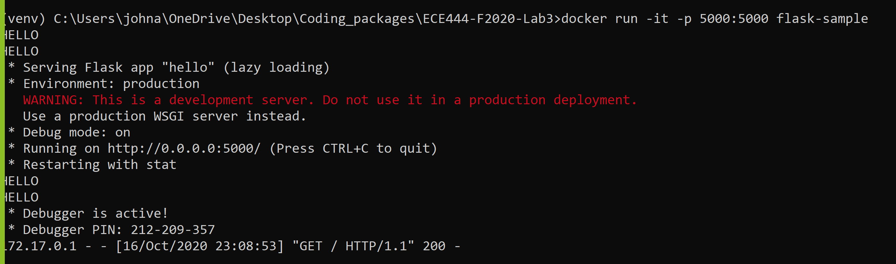
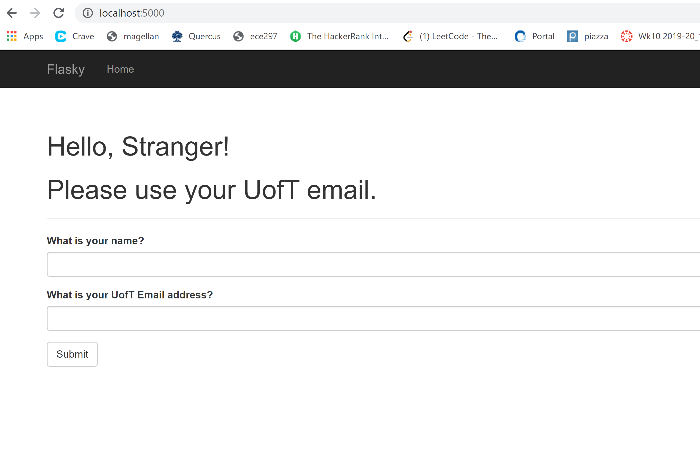

Activity 2

Build the system by getting to the root directory of the dockerfile and the rest of the files
then typing "docker build -t flask-sample:latest ."

Activity 3
Differences between Docker Containers and virtual Machines
A container runs on the systema nd shares a kernal with the host machine.
It is a discrete process just like any other application

A virtual machine is it's own operating system that runs on top of the
hosts operating system.  This requires dedicated resources and has high overheadd
as it requires support for the whole operating system.