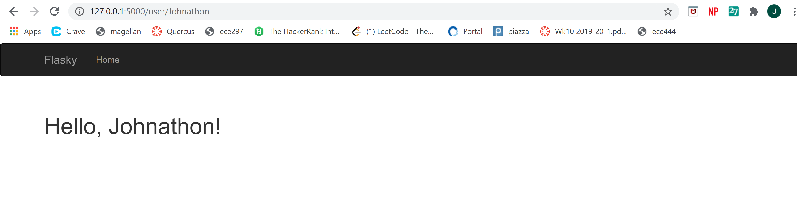
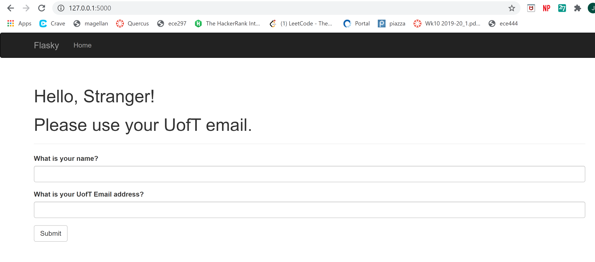
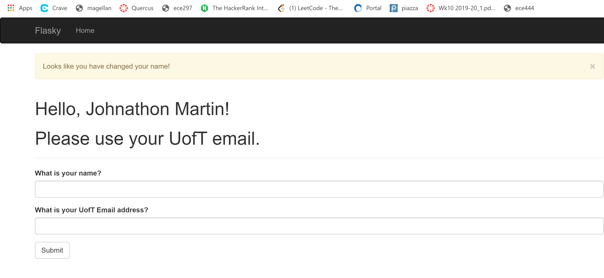

# ECE444-F2020-Lab3
Johnathon Martin
 this repo is a clone of
https://github.com/miguelgrinberg/flasky

Activity 1 

Activity 2

Activity 3: Differences between SQL and noSQL
The major difference is that SQL is relational and noSQL is not.  This means that SQL has a more defined structure
and must use a pre defined schema that is accessed via queries whereas noSQL is more dynamic with no strict underlying structure.  SQL is table based
where as uses document, key-value, graph or wide-column storages.

